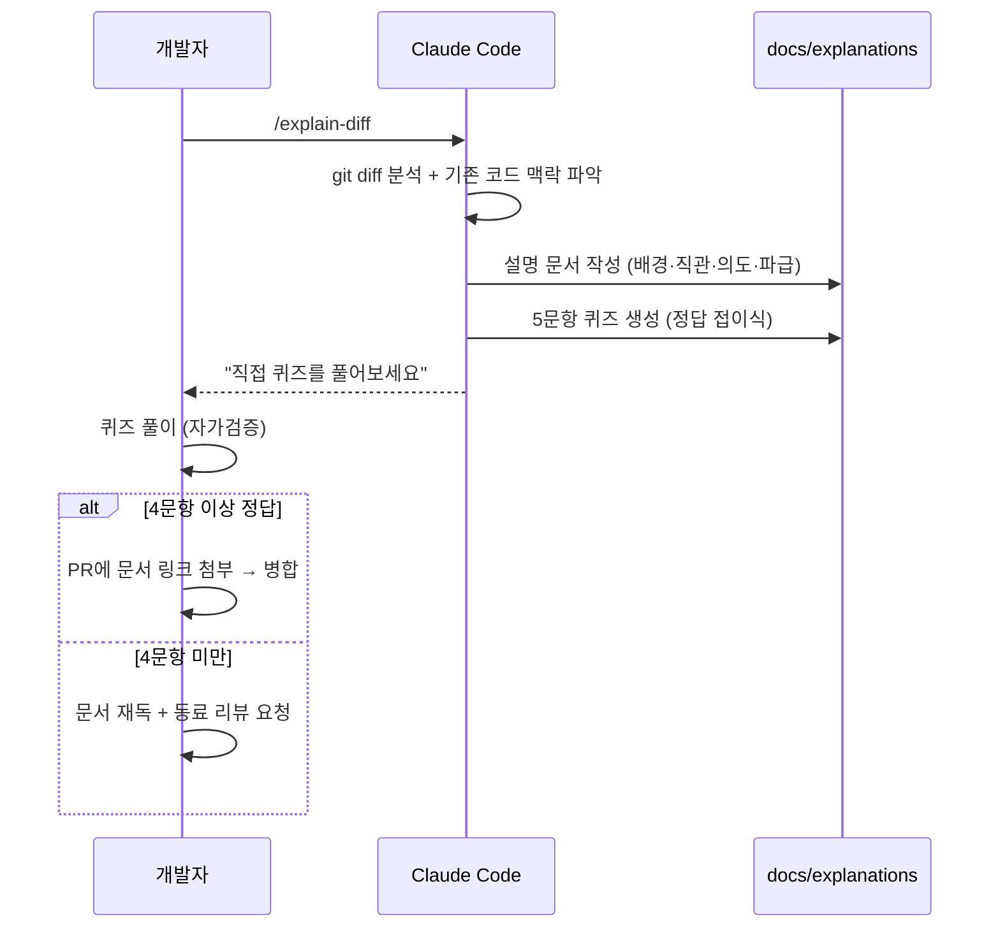

# 축 1 · 설명 문서 + 퀴즈

## 문제의식

코드 리뷰에서 diff만 보면 "무엇이 바뀌었는지"는 알아도 "왜 이렇게 했는지", "전체에서 어떤 의미인지"는
알기 어렵습니다. AI가 코드를 대량 생산하는 상황에서는 더 심각합니다. 그래서 두 가지를 자동화합니다.

1. **Explain Diff 활용** — 단순 코드 비교가 아니라 *전체 시스템 맥락·기본 배경·직관적 개요·작성 의도*를
   담은 종합 설명 문서를 AI가 자동 작성.
2. **속도 조절 장치로서의 퀴즈** — 문서 하단에 *5문항 중간 난이도 퀴즈*를 자동 생성.

## 워크플로우



## 설명 문서에 반드시 담을 것

| 항목 | 왜 중요한가 |
|------|-------------|
| 배경 / 맥락 | 이 변경이 왜 필요했고 전체에서 어디에 위치하는지 |
| 직관적 개요 | 처음 보는 사람도 한 문단으로 감을 잡게 |
| 작성 의도 | *왜* 이렇게 설계했는지, 대안과 트레이드오프 |
| 파급 효과 & 리스크 | 영향 범위, 부작용, 롤백 |

템플릿: [`templates/explanation.md`](../templates/explanation.md)

## 퀴즈 설계 원칙

- **중간 난이도**: 문서를 이해했다면 풀 수 있지만, 대충 읽으면 틀리는 수준.
- **암기 금지**: "왜/어떻게/만약에"를 묻는다. 최소 2문항은 "이 부분을 바꾸면?" 응용 문제.
- **자가 채점**: 정답·해설을 `<details>` 접이식으로 넣어 스스로 먼저 풀게 한다.

## 🚦 자가검증 규칙 (핵심)

> **본인이 자신의 변경에 대한 퀴즈에서 4문항 이상 맞히지 못하면,
> 코드베이스에 반영하지 않고 동료 리뷰를 요청한다.**

- "AI가 짜줬으니 됐다"가 아니라 "내가 이해한 만큼만 내 이름으로 병합한다".
- 통과 기준(4/5)은 팀에서 조정 가능.
- CI는 문서·퀴즈의 **존재**만 강제한다(사람의 이해도는 자동 검증 불가). → `explanation-check.yml`.

## 도입 방법

```bash
./scripts/install-hooks.sh          # push 전 리마인더 훅 설치
```
- `.github/workflows/explanation-check.yml`: 코드 변경 PR에 설명 문서가 없으면 CI 실패.
- `.github/pull_request_template.md`: PR마다 자가검증 체크리스트를 노출.

## 자주 묻는 질문

- **Q. 사소한 변경에도 매번 문서를 써야 하나요?**
  아니요. 오타/포맷/사소한 설정 변경은 제외됩니다(훅·CI가 `*.md`, 설정 등은 제외). "의미 있는 로직 변경"에 적용하세요.
- **Q. 퀴즈를 통과 못하면 코드가 나쁜 건가요?**
  아니요. 작성자의 *이해*가 부족하다는 신호입니다. 코드 품질이 아니라 이해도를 게이트합니다.
