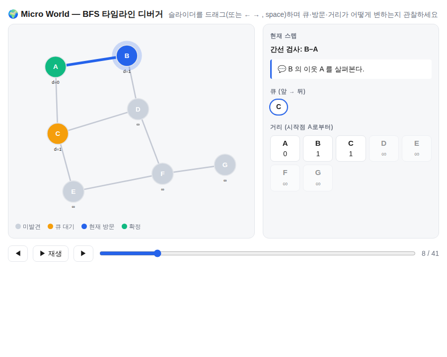
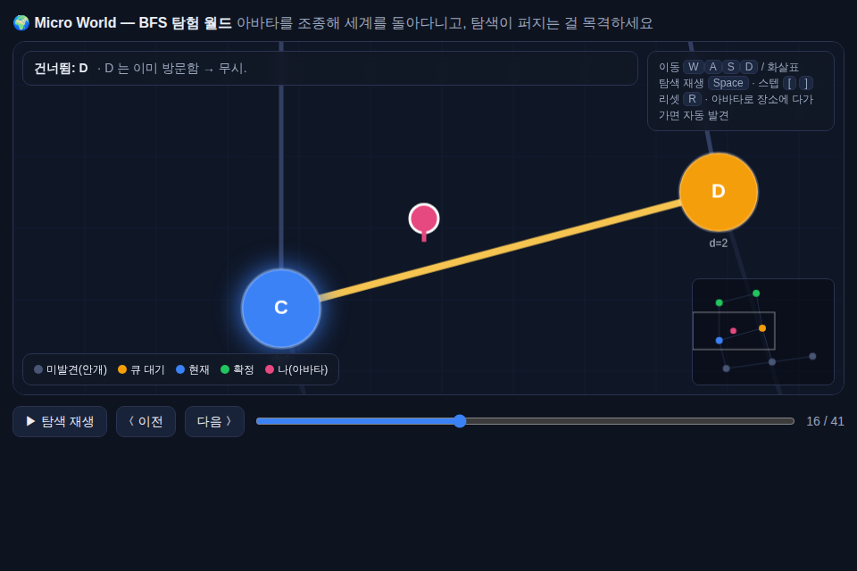

# 축 2 · 마이크로월드 (Micro Worlds)

## 문제의식

시스템의 *동적* 동작 — 상태가 시간에 따라 어떻게 바뀌는가 — 은 정적인 코드를 아무리 읽어도
잘 잡히지 않습니다. 콜스택을 머릿속으로 시뮬레이션하는 건 느리고 오류가 많습니다.

**마이크로월드**는 그 부담을 눈과 손으로 옮깁니다. 시스템의 축소판을 시각적으로 만들고,
**타임라인을 스크럽하며 내부 상태 변화를 직접 조작**해 메커니즘을 감각적으로 이해합니다.

## 언제 쓰나

- 알고리즘(정렬/탐색/그래프 순회)의 단계별 동작을 이해할 때
- 상태 기계 / 리듀서 / 이벤트 루프의 전이를 추적할 때
- 동시성/경합, 큐 처리 순서처럼 "순서가 핵심"인 로직
- 버그 재현: 어느 스텝에서 상태가 틀어지는지 스크럽으로 짚어낼 때

## 워크플로우


1. **계측(instrument)**: 관찰할 지점에서 상태 스냅샷을 남깁니다. 환경변수로 감싸 프로덕션 오염 방지.
   ```
   {"step": 0, "label": "init", "state": { ... }, "note": "설명" }
   ```
2. **trace.json 생성**: 대상을 실행해 스냅샷 배열을 파일로 남깁니다.
3. **재생**: [`templates/micro-world/index.html`](../templates/micro-world/index.html)을 복제한
   `microworlds/<slug>/`에서 trace.json을 로드해 타임라인으로 재생합니다.

`/micro-world <대상>` 슬래시 커맨드가 1~3을 자동 스캐폴딩합니다.

## 완성 예시 — BFS 타임라인 디버거

[`microworlds/bfs/`](../microworlds/bfs/)에 실제로 동작하는 예시가 있습니다.
`index.html`을 브라우저로 더블클릭하면 그래프 BFS를 타임라인으로 스크럽하며 큐·방문·거리 변화를
관찰할 수 있습니다(추적 데이터 인라인 임베드 → 실행환경 불필요).



- `trace_bfs.py` : BFS에 `snap()` 계측을 심어 `trace.json`(41개 스냅샷)을 생성
- `index.html` : SVG 그래프 + 타임라인 슬라이더 + 큐/거리 패널로 재생
- 자세히: [microworlds/bfs/README.md](../microworlds/bfs/README.md)

### 문서형 vs 아바타/월드형 — 같은 데이터, 다른 경험

마이크로월드는 "읽는 디버거"에 머물 필요가 없습니다. 같은 `trace.json`으로 **세계에 들어가 겪는**
아바타/월드형 경험도 만들 수 있습니다 — [`microworlds/bfs-world/`](../microworlds/bfs-world/).



| | `bfs/` (문서형) | `bfs-world/` (아바타/월드형) |
|--|--|--|
| 시점 | 밖에서 관찰 | 세계 안 아바타로 존재 |
| 조작 | 타임라인 스크럽 | 자유 이동(WASD) + 탐색 목격 |
| 이해 | 읽고 분석 | 겪고 감각 |

핵심: **트레이스 데이터는 동일**하고 렌더링 계층만 교체했습니다. "감각적·직관적 이해"라는
마이크로월드의 취지를 끝까지 밀면 이 방향(월드형)이 됩니다.

## trace.json 형식

```json
[
  { "step": 0, "label": "init: 정렬 전", "state": { "arr": [5,2,8,1] }, "note": "시작 상태" },
  { "step": 1, "label": "swap(5,2)",     "state": { "arr": [2,5,8,1] }, "note": "인접 비교" }
]
```

- `state`는 자유 형식 JSON. 뷰어는 기본적으로 숫자 배열을 막대 그래프로 그립니다.
- 다른 형태(그래프 노드, 상태 기계 하이라이트, 커서 위치 등)는 `index.html`의
  `drawViz(state)` 함수를 대상에 맞게 수정해 시각화하세요.

## 뷰어 기능 (템플릿 기본 제공)

- 타임라인 슬라이더 + ◀ ▶ 스텝 이동 + ▶/⏸ 자동 재생
- 키보드: `←` `→` 스텝 이동, `space` 재생/정지
- 좌: 상태 시각화 / 우: Raw JSON, 스텝별 note 표시
- **단일 HTML, 외부 CDN 불필요** — 오프라인/샌드박스에서도 동작
- trace.json 자동 로드, 없으면 파일 드롭/선택 UI

## 팁

- 스냅샷은 "의미 있는 전이"마다 남기세요. 너무 촘촘하면 노이즈, 너무 성기면 인과가 끊깁니다.
- `label`과 `note`에 "무슨 일이 왜 일어났는지"를 적으면 나중에 팀원이 봐도 이해됩니다.
- 완성된 마이크로월드는 축 3(공유 공간)으로 공유하면 팀 전체의 이해 자산이 됩니다.
