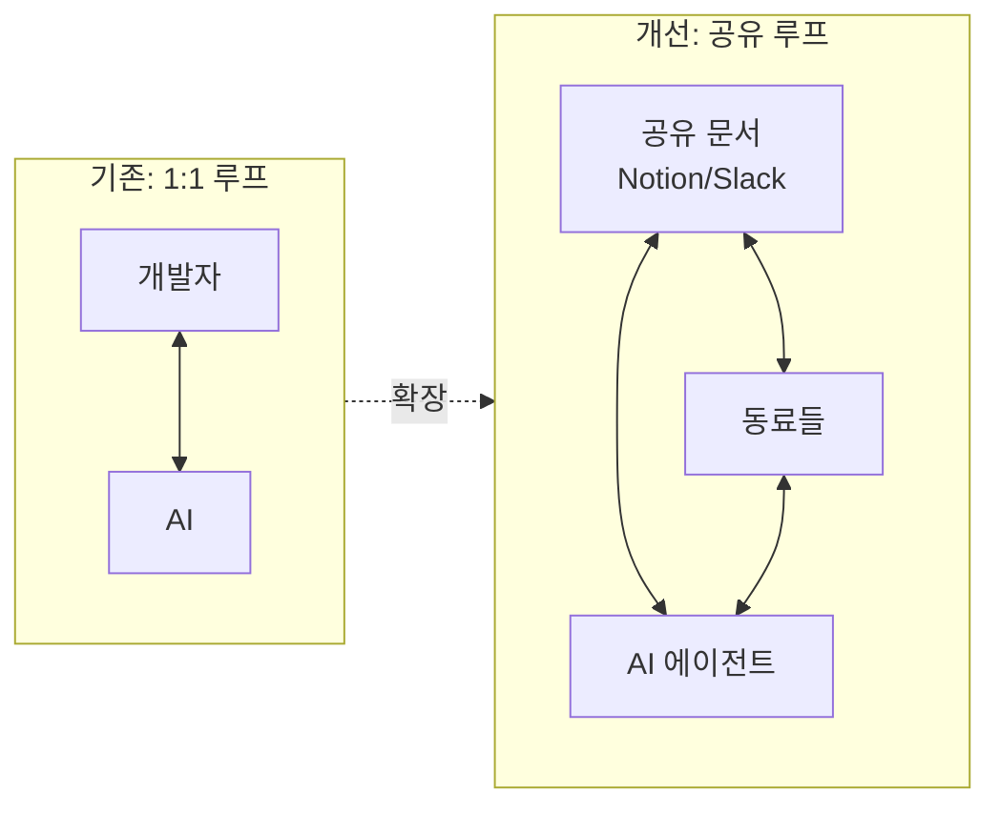

# 축 3 · 공유 공간 활용 (Shared Spaces)

## 문제의식

AI와의 협업은 대개 **1:1 루프**입니다 — 나와 AI만 아는 대화. 이 루프가 반복되면 지식이 개인에게
갇히고, 팀은 "누군가는 이해했겠지" 상태가 됩니다. 축 3의 목표는 이 루프를 **팀의 집단적 이해**로
확장하는 것입니다.

## 핵심 아이디어

- 나 혼자 AI와 대화하는 1:1 루프에서 벗어나, 팀원이 모여 있는 **공유 공간(Notion, Slack 등)**에
  AI 에이전트를 끌어들인다.
- 설계 문서·계획서 위에서 **동료 + AI와 함께 댓글·기획**을 주고받아 프로젝트 전반의 팀 차원
  이해도를 유지한다.

## 워크플로우

1. **내보내기**: 축 1의 설명 문서나 설계 결정을 공유 공간에 요약 게시. → `/share-to-space notion|slack`
   - 정독용 복붙이 아니라, "함께 댓글 달 캔버스"로 만든다.
   - **열린 질문 / 리뷰 요청 포인트**를 명시해 동료·AI가 어디에 답해야 할지 안내.
2. **집단 리뷰**: 동료가 댓글로 의견을 달고, AI 에이전트도 같은 문서에서 질문에 답하거나 대안을 제시.
3. **수렴**: 논의로 확정된 결정을 원본 설명 문서에 반영(back-link)해 단일 진실 소스를 유지.

## 공유용 요약에 담을 것

| 항목 | 설명 |
|------|------|
| 한 문단 개요 | 직관적 설명 (축 1의 "직관적 개요" 재사용) |
| 핵심 설계 결정 3~5개 | 각각 "왜"를 한 줄로 |
| 열린 질문 / 리뷰 포인트 | 동료·AI가 댓글로 답할 지점 |
| 원본 링크 | 설명 문서 / PR / 마이크로월드 |

## 연동 방법

`/share-to-space` 커맨드는 세션에 연결된 MCP 도구를 활용합니다.

- **Notion**: `notion-create-pages`로 팀 페이지 하위에 요약 페이지를 만들고,
  `notion-create-comment`로 리뷰 요청 포인트를 코멘트로 남깁니다.
- **Slack**: 연결된 Slack 연동으로 채널에 요약을 게시합니다. 연동이 없으면 붙여넣기용
  마크다운 블록을 출력합니다.

> ⚠️ 외부 게시는 되돌리기 어렵습니다. 커맨드는 실제 게시 전에 요약을 보여주고 확인을 받습니다.

## 운영 팁

- **정기 리듬**: 스프린트/주간 단위로 "이해 공유" 시간을 두고 최근 설명 문서·마이크로월드를 공유.
- **AI를 팀원처럼**: 공유 문서에서 AI에게 "이 결정의 리스크는?", "놓친 엣지케이스는?"을 공개 질문으로.
- **결정 로그화**: 확정된 설계 결정은 back-link로 축 1 문서에 남겨, 나중에 "왜 이렇게 했지?"에 답한다.
- 축 1·2의 산출물(설명 문서, 마이크로월드)이 공유 공간의 좋은 재료가 됩니다 — 세 축은 순환합니다.
