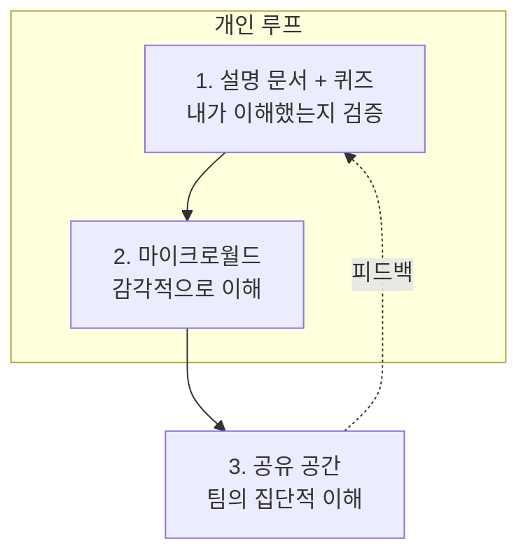

# AI 협업 시스템 — 개요

## 왜 필요한가

AI 코딩 도구는 **작성 속도**를 극적으로 끌어올렸습니다. 하지만 팀의 **이해 속도**는 그대로입니다.
그 결과, 아무도 온전히 이해하지 못한 코드가 빠르게 쌓이는 "이해 부채(comprehension debt)"가 생깁니다.

이 시스템의 목표는 단순합니다 — **작성 속도와 이해 속도의 균형**. 세 가지 축으로 접근합니다.



## 세 가지 축 요약

### 축 1 · 설명 문서 + 퀴즈 → "속도 조절 장치"
- AI가 diff를 넘어 **맥락·직관·의도**를 담은 설명 문서를 자동 작성.
- 문서 하단에 **5문항 중간 난이도 퀴즈**를 자동 생성.
- **자가검증 규칙**: 본인이 퀴즈를 통과 못하면 머지하지 않고 동료 리뷰 요청.
- 도구: `/explain-diff`, `templates/explanation.md`, git 훅, CI 게이트.
- 상세: [01-explanations-and-quizzes.md](01-explanations-and-quizzes.md)

### 축 2 · 마이크로월드 → "감각적 이해"
- 텍스트 코드를 정독하는 대신, **타임라인 스크럽 가능한 시각적 디버거**를 AI로 구축.
- 상태 전이를 직접 조작하며 시스템 메커니즘을 직관적으로 파악.
- 도구: `/micro-world`, `templates/micro-world/`.
- 상세: [02-micro-worlds.md](02-micro-worlds.md)

### 축 3 · 공유 공간 → "집단적 이해"
- 1:1 AI 루프에서 벗어나 Notion/Slack 등 공유 공간에 AI 에이전트를 초대.
- 설계 문서 위에서 동료·AI와 댓글로 협업하며 팀 차원의 이해도 유지.
- 도구: `/share-to-space`.
- 상세: [03-shared-spaces.md](03-shared-spaces.md)

## 도입 순서 제안

1. **축 1부터**: 가장 자동화가 명확하고 즉시 문화적 효과가 큽니다. `install-hooks.sh` + CI 게이트.
2. **축 2 선택 도입**: 복잡한 알고리즘/상태 기계를 다루는 팀에서 큰 효과.
3. **축 3 확장**: 팀 규모가 커지고 여러 사람이 같은 시스템을 만질 때.

## 파일 지도

```
.claude/commands/     explain-diff, micro-world, share-to-space  (슬래시 커맨드)
templates/            explanation.md, micro-world/               (산출물 템플릿)
scripts/              install-hooks.sh, git-hooks/pre-push       (자가검증 리마인더)
.github/workflows/    explanation-check.yml                      (CI 게이트)
docs/                 가이드 + docs/explanations/ (생성된 설명 문서 보관)
```
