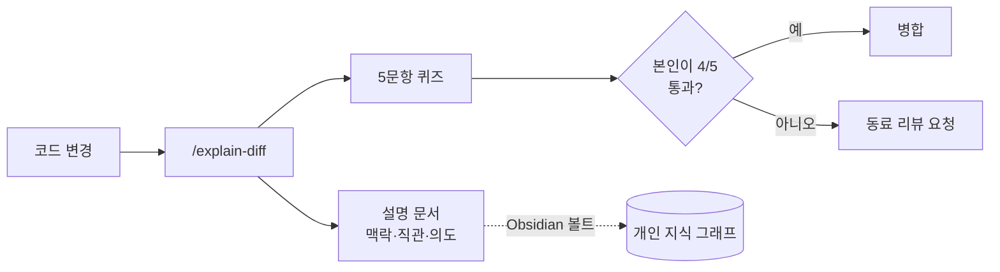

# AI 협업 시스템 툴킷 도입 — 설명 문서

- **작성자**: RohGyuMin (with Claude Code)
- **날짜**: 2026-07-21
- **관련 브랜치/PR**: `claude/ai-collaboration-system-jb2ebn` / [PR #2](https://github.com/RohGyuMin/go/pull/2)
- **변경 규모**: 신규 파일 19개 (커맨드 3 · 템플릿 4 · 스크립트 3 · 문서 6 · CI 1 · 기타)

> ℹ️ 이 문서는 `/explain-diff`가 생성하는 산출물의 **실제 예시**입니다. 맨 아래에 5문항 퀴즈가 붙습니다.

## 1. 배경 / 맥락 (왜 필요한가)

AI 코딩 도구는 코드 **작성 속도**를 크게 끌어올렸지만, 팀이 그 코드를 **이해하는 속도**는 그대로입니다.
그 결과 "아무도 온전히 이해하지 못한 코드"가 빠르게 쌓이는 *이해 부채(comprehension debt)*가 생깁니다.
이 저장소는 원래 빈 상태(README만 존재)였고, 그 위에 "작성 속도와 이해 속도의 균형"을 잡기 위한
시스템을 처음부터 스캐폴딩했습니다. 세 가지 축으로 접근합니다: **① 설명 문서+퀴즈, ② 마이크로월드,
③ 공유 공간 연동**.

## 2. 직관적 개요 (One-paragraph intuition)

한 마디로, 이건 **"AI가 코드를 짜주면, AI가 그 코드에 대한 설명서와 쪽지시험을 같이 만들어주고,
개발자가 그 시험을 통과해야 병합할 수 있게 하는 브레이크 장치"**입니다. 시험을 못 풀면 = 내가 아직
이해 못 했다는 뜻이므로, 머지하지 않고 동료 리뷰를 받습니다.

## 3. 핵심 변경과 작성 의도 (What & Why)

| 파일/영역 | 무엇을 만들었나 | **왜** 그렇게 했나 (의도·대안·트레이드오프) |
|-----------|----------------|---------------------------------------------|
| `.claude/commands/*.md` | `/explain-diff`, `/micro-world`, `/share-to-space` 슬래시 커맨드 | Claude Code의 커맨드는 마크다운 지시문이라 팀이 읽고 고치기 쉬움. 별도 앱/봇보다 도입 장벽이 낮음 |
| `scripts/install-hooks.sh` + `git-hooks/pre-push` | push 전 자가검증 리마인더 | 강제 차단(hard block)이 아니라 리마인더로 둠 — 사소한 변경까지 막으면 마찰이 커져 오히려 우회됨. `--no-verify`로 탈출구 제공 |
| `scripts/install-global.sh` | 커맨드를 `~/.claude/commands/`에 설치 | 프로젝트마다 복붙하지 않고 **모든 프로젝트**에 한 번에 적용하기 위함 |
| `explain-diff`의 Obsidian 단계 | `OBSIDIAN_VAULT` 설정 시 볼트에도 저장 | 설명 문서를 프로젝트 경계를 넘어 **개인 지식 그래프**로 축적. 볼트는 개인 파일이라 git엔 커밋하지 않음 |
| `.github/workflows/explanation-check.yml` | 코드 변경 PR에 설명 문서 동반을 강제하는 CI 게이트 | 사람의 *이해도*는 자동 검증 불가 → 문서·퀴즈의 *존재*만 기계로 강제하고, 통과 여부는 사람의 정직함에 맡김 |
| `templates/micro-world/index.html` | 단일 HTML 타임라인 디버거 | 외부 CDN 의존 없이 오프라인/샌드박스에서도 열리게. `trace.json`만 갈아끼우면 재사용 |

## 4. 파급 효과 & 리스크

- **영향받는 부분**: 신규 저장소라 기존 코드에 대한 파괴적 영향 없음. 팀의 **워크플로우/문화**에 영향.
- **잠재적 부작용**:
  - CI 게이트가 사소한 변경에도 문서를 요구하면 마찰 → `*.md`·`docs/**`·`.github/**`는 제외 처리.
  - 자가검증은 사람이 정직하게 지키는 규칙이라 강제성이 약함 → 팀 합의와 리뷰 문화로 보완 필요.
- **롤백 방법**: 훅은 `.git/hooks/pre-push` 삭제, CI는 워크플로 파일 삭제, 전역 커맨드는
  `~/.claude/commands/`에서 제거. 모두 독립적이라 부분 롤백 가능.

---

## 🧪 자가검증 퀴즈 (5문항 · 중간 난이도)

> 먼저 스스로 풀어보세요. **4문항 이상** 맞히지 못하면 머지하지 말고 동료 리뷰를 요청합니다. (자가검증 규칙)

**Q1. 이 시스템이 해결하려는 근본 문제는 무엇인가?**
- (a) 코드 작성 속도가 느린 것
- (b) 코드는 빠르게 늘지만 팀의 이해 속도가 못 따라가는 "이해 부채"
- (c) 테스트 커버리지 부족
- (d) 배포 파이프라인 속도

정답 & 해설
정답: (b). 이 시스템은 작성 속도가 아니라 <b>이해 속도</b>의 균형을 목표로 합니다. 그래서 퀴즈가 "속도 조절 장치" 역할을 합니다.

**Q2. pre-push 훅을 강제 차단(exit 1)이 아니라 리마인더(exit 0)로 만든 의도는?**

정답 & 해설
사소한 변경까지 전부 막으면 마찰이 커져 개발자가 규칙 자체를 우회하게 됩니다. 그래서 "상기시키되 막지 않고", <code>--no-verify</code> 탈출구를 둡니다. 강제는 CI(문서 존재 여부)와 사람의 자가검증이 담당합니다.

**Q3. CI 게이트(`explanation-check.yml`)는 "개발자가 자기 코드를 이해했는지"를 검증하는가?**
- (a) 예, 퀴즈 점수를 채점한다
- (b) 아니오, 설명 문서·퀴즈의 *존재* 여부만 확인한다

정답 & 해설
정답: (b). 사람의 이해도는 기계로 검증할 수 없습니다. CI는 문서/퀴즈가 <b>있는지</b>만 강제하고, 실제 통과(4/5) 여부는 개발자가 정직하게 지키는 규칙입니다.

**Q4. `OBSIDIAN_VAULT`를 설정하지 않고 `/explain-diff`를 실행하면 어떻게 되나?**

정답 & 해설
Obsidian 저장 단계를 <b>건너뛰고</b>, 프로젝트 <code>docs/explanations/</code>에는 정상적으로 저장됩니다. 그리고 볼트 저장을 켜는 방법을 한 줄 안내합니다. 즉 Obsidian은 선택 기능입니다.

**Q5. 만약 CI 게이트에서 `docs/**`와 `*.md` 제외 규칙을 없애면 무슨 일이 생기나?**

정답 & 해설
오타 수정·문서만 고친 PR에도 "설명 문서가 없다"며 CI가 실패하게 됩니다. 이 제외 규칙은 <b>의미 있는 로직 변경에만</b> 게이트를 적용하려는 장치입니다. 없애면 마찰이 급증합니다.

---

### 자가검증 결과 (본인 기록용)

- [ ] 5문항을 직접 풀었다
- [ ] 4문항 이상 정답 → 병합 진행
- [ ] 4문항 미만 → 동료 리뷰 요청함 (리뷰어: __________)
