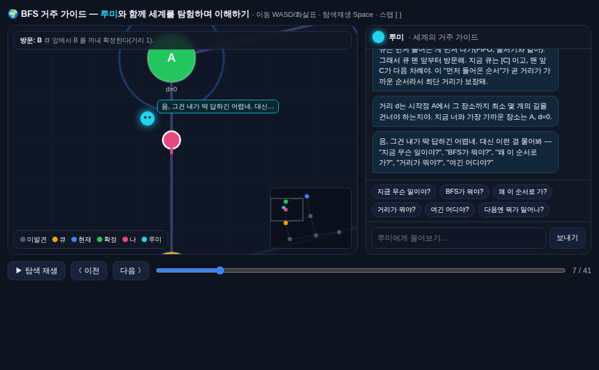

# 마이크로월드 — BFS 거주 가이드 "루미" (4단계: 거주 AI)

관점 로드맵의 **4단계 — 거주 AI**. 세계 안에 사는 가이드 AI **루미(Lumi)**가 아바타를 따라다니며,
지금 무슨 일이 벌어지는지 곁에서 설명하고, 질문에 답합니다. "문서를 읽어주는 AI"가 아니라
**"같은 세계에 함께 있는 AI"**입니다.

## 무엇이 다른가 (3단계까지 vs 4단계)

| | `bfs-world/` (아바타형) | `bfs-guide/` (거주 AI) |
|--|--|--|
| AI | 없음 (내가 혼자 목격) | 세계에 **거주하는 가이드**가 동행 |
| 이해 경로 | 스스로 관찰 | **대화하며** 이해 |
| 상호작용 | 이동·스크럽 | + 질문/답변 + 문맥 코멘트 |

## 루미가 하는 일

- **문맥 코멘트(자동)**: 탐색이 진행되면 곁에서 해설. 예) *"이제 C를 확정했어(거리 1). C의 이웃들을 둘러볼 차례야."*
- **질문 응답**: 아래 칩을 누르거나 자유 입력.
  - "지금 무슨 일이야?" → 현재 스텝을 세계 상태로 풀어 설명
  - "왜 이 순서로 가?" → 큐(FIFO)와 최단거리 보장의 관계
  - "거리가 뭐야?" / "여긴 어디야?" → **네 위치 기준**으로 가장 가까운 장소·거리·이웃 안내
  - "다음엔 뭐가 일어나?" → 다음 스텝 미리보기
- 답은 **현재 월드 상태(큐·방문·거리·네 위치)를 실제로 읽어** 생성됩니다(문맥 인식).

## 조작
- 이동 `WASD`/화살표 · 탐색재생 `Space` · 스텝 `[` `]` · 리셋 `R`
- 채팅창에 입력하거나 질문 칩 클릭. (채팅 입력 중엔 이동키가 잠겨 오타 이동 방지)

## 설계 노트 — 왜 스크립트 대화 엔진인가

Claude 아티팩트 런타임이 이 사용자에게 제공하는 역량은 `downloads`·`mcp`뿐이라, **범용 LLM 대화
기능은 없습니다.** 그래서 루미는 백엔드 없이 **월드 상태를 읽어 문맥에 맞게 답하는 자체 완결형
대화 엔진**으로 구현했습니다 — 어디서나(오프라인·더블클릭) 동작하고 repo에 커밋됩니다.
진짜 자유 대화(LLM)로 올리려면 별도 백엔드(예: Claude API 프록시)를 붙여 `answer()`를
교체하면 됩니다. 인터페이스(문맥→답변)는 그대로 재사용할 수 있게 분리해 뒀습니다.
